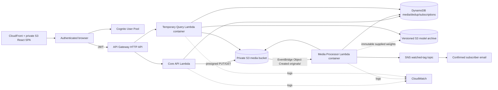

# Architecture

## Runtime topology

This Mermaid diagram is for engineering documentation. The final team-report
diagram must be rebuilt with official AWS architecture icons.

## Security boundaries

- Cognito issues short-lived JWTs; API Gateway validates issuer, audience, and
  expiry before invoking business handlers.
- S3 buckets block public access. The frontend receives short-lived presigned
  operations only after authorization.
- Lambda roles are separate and scoped to the exact bucket prefixes, tables,
  topic, and log groups they need.
- No browser receives AWS access keys. No secret is committed.
- Media keys are UUID-based and sanitized; filenames are metadata, not trusted
  path components.
- Query and upload inputs have bounded sizes/types and JSON schema validation.

## Processing states

`RESERVED → UPLOADED → PROCESSING → READY`

Failures transition to `FAILED` with a safe error code. Replayed S3 events are
idempotent: a `READY` record is not processed twice, and deterministic
notification event IDs are conditionally claimed before publish. A notification
failure never changes successfully processed media back from `READY`.

## Notification policy

- Subscription identity and email come only from verified Cognito claims.
- SNS email confirmation remains `PENDING` until the SNS subscription attributes
  report it as confirmed.
- Each subscriber gets an SNS filter policy containing normalized watched tags.
- A media update publishes one `String.Array` tag attribute, allowing any watched
  tag to match without sending one email per animal label.
- Messages contain identifiers, filename and matched tags, but no credentials or
  durable public media URL.

## Media URL policy

DynamoDB stores `original_key` and `thumbnail_key`. API responses contain
expiring presigned URLs. The database never treats a signed query string as a
durable identifier.

## ML policy

- supplied detector and classifier only; no retraining is required;
- the original supplied classifier pickle is converted in an isolated image
  build stage to numerically checked TorchScript; ONNX/protobuf-6 build
  dependencies never enter the final MegaDetector/protobuf-3 runtime;
- supplied weights and labels are baked into the immutable Lambda image, while
  the versioned model bucket remains an auditable deployment archive;
- model version, paths, thresholds, and class-map path are environment values;
- processes load each model once per warm Lambda execution environment;
- image counts equal accepted animal detections after classification;
- video counts use the maximum simultaneous accepted count for each species
  across exact 1-second samples, avoiding artificial count inflation when one
  animal remains across multiple seconds.

## Cost and deployment boundary

- a template rule rejects deployment outside `ap-southeast-2`;
- DynamoDB uses on-demand mode, API throttling is 5 requests/second, heavy
  Lambda work is bounded by upload/video limits and timeouts, and CloudWatch
  logs expire after seven days; reserved concurrency is omitted for compatibility
  with AWS Academy's minimum unreserved-concurrency requirement;
- query-temp objects expire after one day and incomplete multipart uploads abort;
- no EC2, NAT Gateway, RDS, OpenSearch, SageMaker, EFS or WAF is present;
- the root stack can bootstrap native Cognito without secrets; Google is enabled
  only by a later NoEcho stack update once exact CloudFront/Cognito redirects and
  team-owned credentials are available.
