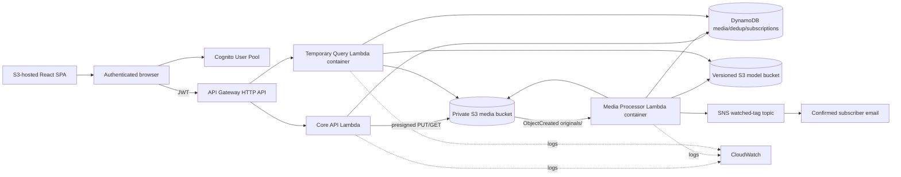

# Architecture

## Runtime topology

This Mermaid diagram is for engineering documentation. The final team-report
diagram must be rebuilt with official AWS architecture icons.

## Security boundaries

- Cognito issues short-lived JWTs; API Gateway validates issuer, audience, and
  expiry before invoking business handlers.
- S3 buckets block public access. The frontend receives short-lived presigned
  operations only after authorization.
- Lambda roles are separate and scoped to the exact bucket prefixes, tables,
  topic, and log groups they need.
- No browser receives AWS access keys. No secret is committed.
- Media keys are UUID-based and sanitized; filenames are metadata, not trusted
  path components.
- Query and upload inputs have bounded sizes/types and JSON schema validation.

## Processing states

`RESERVED → UPLOADED → PROCESSING → READY`

Failures transition to `FAILED` with a safe error code. Replayed S3 events are
idempotent: a `READY` record is not processed twice, and notification event IDs
are recorded before publish.

## Media URL policy

DynamoDB stores `original_key` and `thumbnail_key`. API responses contain
expiring presigned URLs. The database never treats a signed query string as a
durable identifier.

## ML policy

- supplied detector and classifier only; no retraining is required;
- model bucket key, version, SHA-256, thresholds, and class-map path are
  environment/configuration values;
- processes load each model once per warm Lambda execution environment;
- image counts equal accepted animal detections after classification;
- video counts use the maximum simultaneous accepted count for each species
  across exact 1-second samples, avoiding artificial count inflation when one
  animal remains across multiple seconds.

